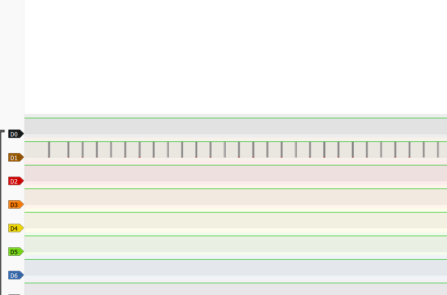

# NItectf  writeups
this writeup is to document all the c hallenges soolved by me in the nitctf competition

## Challenge-1 u-are-t-detective
This challenge start with giving us a signal.sr file|

A `.sr` is used store captured signal data (like digital waveforms) from a logic analyzer or similar tools.It also  allows you to save, share, and reload captured signals in PulseView for further analysis.

Thus I downloaded `pulseview` to view this captured signal

Hm...... I see 

since the title mentions UART, i use the UART decoder but the question is to what should be the baud rate, so i just decide to add the baud rate corresponding to each type of signal

And get the baud rate equal to 5.33 million

Now i get the signal code which is binary.

So i convert the binary into ascii to get the flag
  

## Challenge-2 Layered Secrets

#### Description: Bob, a student in your class, sends a message encrypted using his implementation of standard AES. However, feeling it isn't sufficient, he modifies the code and re-encrypts the resulting ciphertext using the altered AES. He then shares the final ciphertext along with the code he used for encryption of altered AES. Can you decipher the original message?The passphrase used is "EncryptedLessons14821"

Ok so i get 4 files 
AESencrypt for the encrypttion

AESencryptfunc for the functions that are used in an AES encryption

BitVector for the bitvector function

ciphertext containing the cipher text

So we know that our message is ciphered with standard aes, then that ciphered text is again ciphered with custom AES as given in the file
So decrypt that file to get the original ciphered text like in 
`Final.py`

Now Then using the new original crypted text i rework the `Final.py` using the same passphrase and got the flag
`nite{435_15_7H3_K3Y_70_3NCRYP710N_826502}`
  

## Challenge-3 Tet-riffic
OK this was a roller coaster

we get a `tetris.pcapng` file and a `tetris.py` file
It seems that `teris.pcapng` contains some TCP packages
On diltering it with the help of wireshark, i see that these are keyboard HID inputs.

Now i filter the inputs using wsl code
`tshark -r traffic.pcapng -Y "usbhid.data.array != 00:00:00:00:00:00 && usb.data_flag" -T fields -e frame.time_epoch -e usbhid.data.array > keystrokes_with_time.txt`

Now i take the inputs into the game file to get a broken qr

After solving the qr using `QRazyBOX`
I get the flag 
