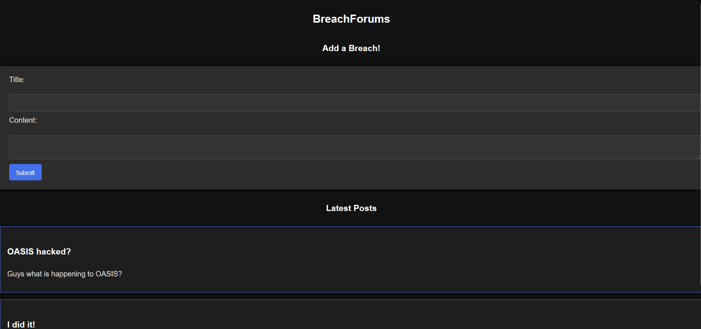

# It all starts with a flag
It all started with challenge that asked me to add the flag it has given. So began my first ever CTF.
Ready PLayer?
.
.
.
.
*Goooooo*
   

## I am Optimus Prime
As you set out to warn the OASIS community about the Trojan's infiltration, your efforts are abruptly interrupted. Mechanoids, armed and dangerous, have been dispatched by IOI to stop you. These mechanical enforcers close in, their metallic limbs glinting in the digital light. It's time to fight back and escape their relentless assault. Can you outmaneuver these foes and stay alive? https://blogpost.oasis.cryptonite.live

This was the prompt, on going to the said link I reach the website that looked something like this

Since it is one of those webpage challenge my first instint was to go into inspect element and search for if I can find any functionality to the save button??? Did't find anything

So i went to that discord and the hin that was given said something about `"robot-only" no no zone`.
On chatgpting It turns out in webpages there are some areas that are restricted for most people. To keep web crawlers away from this areas, developers add sections telling which area is prohibited.

Following on that I add `/robots.txt` to the url and got into a page giving this output
    User-agent: *
    Disallow: /hiddenFlag

Meaning the /hiddenFlag area is prohibited for everyone, so that means I will need tp try somnething in the console to get the flag output.

So I searched how do we usually get access to this kind of area?????
